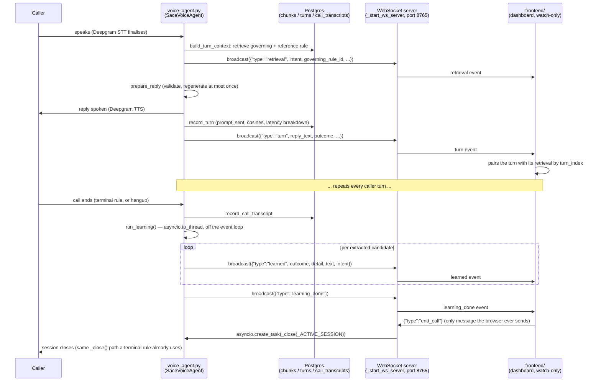

# sace-chat — Architecture

State-Aware Context Engineering for a scripted outreach agent.

---

## 1. Summary

**sace-chat** replaces a monolithic 5,782-token agent system prompt with two parts: a small **STABLE CORE** (548 tokens, always sent) and a **flat memory of 39 individual rules** (21 general + 18 intent-routed) stored in Postgres/pgvector, of which at most **two** reach any given turn's prompt — selected purely by semantic similarity to what the caller just said. Because the per-turn prompt is `CORE + INSTRUCTION + (1–2 rules)`, its size is **O(rules in scope)**, not O(total rules): adding the 40th, 100th, or 500th rule to memory does not change what a turn costs, whereas a monolith pays for every rule on every turn. Measured on this rulebook, a turn costs **roughly 1,000–1,350 tokens against the 5,782-token baseline (about 77–82% smaller)**, while the sum of all rule text — what a monolith would carry — is already 4,287 tokens and grows with every rule added. (Run `phase1_stats.py` for the exact current figures — they move as rules are added, and the numbers here are a snapshot.)

Two front ends now sit on top of the same `Engine`: a Streamlit chat app (`streamlit_app.py`) and a **LiveKit voice agent** (`voice_agent.py`) that answers real calls via Deepgram STT/TTS. Both call into `Engine.build_turn_context` / `Engine.step` / `Engine.prepare_reply`, so retrieval, assembly and validation are one code path regardless of which front end is talking. The voice agent also runs a small **WebSocket spectator server**, broadcasting what it is doing turn-by-turn to a **live dashboard** (`frontend/`) — see [§7](#7-the-live-dashboard-voice_agentpy--frontend) for the whole mechanism.

On top of the live path sits a **post-call learning loop**: after a call ends, an LLM proposes new rules from the transcript, and each candidate must pass three independent verification gates — **grounding** (is this actually attested in the transcript?), **duplicate** (do we already know this?), and **conflict** (does this contradict a rule we already hold?) — before it is embedded and inserted into the same pool the live path reads from. A candidate that fails grounding or conflict is written to a `needs_review` table for a human, never silently applied and never silently dropped. That gate stack is what makes "the agent learns from its calls" a defensible claim rather than a dangerous one.

---

## 2. End-to-end flow

Lane A is the live turn. Lane B is post-call consolidation. The **thick coloured edges** are the loop closing: rules written by Lane B are read by Lane A's retrieval on subsequent calls, with no code change and no redeploy.

```mermaid
%% RL, not TD: the feedback edge makes Lane A a layout sink, so left-to-right
%% direction is what puts Lane A first and the shared table between the lanes.
flowchart RL
    DB[("chunks<br>Postgres + pgvector<br>39 seed + N learned")]
    REVIEW[("needs_review<br>human queue")]

    subgraph LANE_A["LANE A — live turn: one LLM call, ~1.0-1.3k tokens"]
        direction TB
        A1["caller message"]
        A2["embed message, and the tail of Maya's<br>previous turn, in ONE batch call<br>embeddings.embed_many"]
        A3{"IntentRouter.detect<br>cosine vs 72 caller-phrased exemplars<br>best label >= 0.45 ?"}
        A4["manager.resolve_precedence<br>abuse outranks dnc, named time outranks busy"]
        A5["_fetch_by_intent<br>WHERE intent = :intent<br>ORDER BY priority_rank, distance<br>LIMIT 1"]
        A6["_fetch_general<br>WHERE intent IS NULL<br>ORDER BY distance<br>LIMIT 2"]
        A7["GOVERNING = nearest rule<br>REFERENCE = runner-up<br>suppressed entirely if governing.exclusive"]
        A8["assemble.build_turn_prompt<br>CORE + GOVERNING + REFERENCE<br>+ ALREADY ASKED + RECENT TURNS + JSON schema"]
        A9["capture prompt_sent verbatim<br>assert_message_present"]
        A10["llm.chat_json<br>returns intent, reply,<br>call_should_end, extracted_fields"]
        A11["manager.validate_turn<br>clamp intent to vocabulary<br>strip control tokens"]
        A12{"Engine._judge<br>score_reply: reply cosine vs<br>governing and reference spans"}
        A13["regenerate ONCE<br>with an explicit correction block"]
        A14["governing.terminal decides whether<br>the call ends, in both directions<br>strip_after_terminal"]
        A15["reply shown to caller"]
        A16["history + asked_questions updated"]
    end

    subgraph LANE_B["LANE B — post-call learning: between calls only, never on the hot path"]
        direction TB
        B1["call ends: a terminal rule fired<br>state.ended = True"]
        B2["full transcript"]
        B3["consolidator.extract_candidates<br>LLM proposes <= 3 rules, each with<br>text + cue + intent + source_line"]
        B4{"GATE 1 — grounding<br>is source_line verbatim<br>in the transcript ?"}
        B5{"GATE 2 — duplicate<br>cue cosine vs pool, SAME SECTION ONLY<br>(same intent, or the general pool)<br>> 0.72 ?"}
        B6{"GATE 3 — conflict<br>cosine > 0.6 AND numbers differ<br>or assert/deny flip ?"}
        B7["insert_chunk<br>embed the CUE, validate the vector,<br>source = learned"]
        B8["skipped as already known"]
    end

    A1 --> A2
    A2 --> A3
    A3 -->|"intent found"| A4
    A4 --> A5
    A3 -->|"no intent"| A6
    A5 --> A7
    A6 --> A7
    A7 --> A8
    A8 --> A9
    A9 --> A10
    A10 --> A11
    A11 --> A12
    A12 -->|"ungrounded or spliced"| A13
    A13 -.->|"one retry only"| A8
    A12 -->|"grounded"| A14
    A14 --> A15
    A15 --> A16
    B1 --> B2
    B2 --> B3
    B3 --> B4
    B4 -->|"NOT attested"| REVIEW
    B4 -->|"attested"| B5
    B5 -->|"yes"| B8
    B5 -->|"no"| B6
    B6 -->|"contradicts existing rule"| REVIEW
    B6 -->|"clean"| B7
    A16 -->|"call over"| B1
    B7 ==>|"writes"| DB
    DB ==>|"read every turn — THE LOOP CLOSES"| A5
    DB ==>|"read every turn"| A6

    linkStyle 27 stroke:#e0479e,stroke-width:4px
    linkStyle 28 stroke:#e0479e,stroke-width:4px
    linkStyle 29 stroke:#e0479e,stroke-width:4px
```

The two lanes share exactly one thing: the `chunks` table. Lane B never calls into Lane A, and Lane A never calls into Lane B — the only coupling is data. That is deliberate: it is what keeps learning off the latency-critical path.

---

## 3. File-by-file breakdown

Fourteen modules in `sace_chat/`, plus three test files and the two front ends
that sit outside the package (`streamlit_app.py` and `voice_agent.py`).
Dependency direction is strictly one-way:
`models` ← `kb` ← {`db`, `retrieve`, `consolidator`} ← `engine` ← {`streamlit_app`, `voice_agent`}.
Nothing in `sace_chat/` imports either front end, and `retrieve.py` imports no
policy — `manager.resolve_precedence` is injected into it as a parameter.

### `sace_chat/__init__.py`

Empty (0 bytes) — marks the package. No re-exports, so every import is explicit
about which module it comes from.

### `sace_chat/models.py`

**Purpose.** The single in-memory representation of a rule, shared by the KB, the DB layer, retrieval, and the consolidator.

| Member | Type | Meaning |
|---|---|---|
| `Chunk` | `@dataclass` | One rule. |
| `.id` | `str` | Primary key, e.g. `benefits_check`, `special_dnc`, `learned_71a695d9`. |
| `.title` | `str` | Human label, shown in the UI. |
| `.text` | `str` | What the model is *shown*. Contains the scripted line Maya speaks. |
| `.cue` | `str` | What the rule is *retrieved by*. Empty means fall back to `.text`. **This separation is load-bearing — see [§4](#4-key-design-decisions).** |
| `.intent` | `str \| None` | The one routing key. `None` = a general rule reachable by plain similarity. |
| `.priority` | `str` | `critical` / `high` / `normal` / `low`. Ranks above distance *within an intent*. |
| `.terminal` | `bool` | Speaking this rule ends the call. Authoritative — the LLM does not get a vote. |
| `.exclusive` | `bool` | Nothing else may be in scope alongside it; REFERENCE is emptied. |
| `.source` | `str` | `seed` (hand-authored) or `learned` (written by the consolidator). |
| `.learned_kind` | `str \| None` | `policy` / `example` / `failure`. Provenance only. |
| `.tags` | `dict` | Scratch space; retrieval stashes the query distance here. Never queried in SQL. |

**Called by:** `kb.py` (constructs 39 of them, as of this writing), `db.insert_chunk`, `retrieve._row_to_chunk`, `consolidator.run_learning_loop`.

---

### `sace_chat/kb.py`

**Purpose.** The hand-authored knowledge base: the stable core, the intent exemplar sets, and the seed rules. Pure data — no logic.

| Member | What it is |
|---|---|
| `STABLE_CORE` | 548 tokens. Role, the call's goal, personality, the "governing rule is your only source" constraint with an explicit prohibition list, safety, number/spelling conventions. Sent on every turn. |
| `INTENT_EXEMPLARS` | `dict[str, list[str]]` — **18 labels, 72 short caller-phrased exemplars.** The routing table for `IntentRouter`. |
| `RULES` | `list[Chunk]` — **39 rules: 21 general** (`intent=None`) **+ 18 intent-routed**. 12 are `terminal`, the same 12 are `exclusive`. |
| `CHUNKS` | Back-compat alias for `RULES`. |

> These counts move as the KB grows — verify against `phase1_stats.py`'s output or `len(kb.RULES)` before quoting them elsewhere. As of this writing the four newest intent labels are `payment_q`, `appointment_scheduling`, `eligibility_renewal`, and `complaint_escalation`, each with its own `special_*` rule. The general pool also grew a short sub-flow off the "still has benefits" happy path — see the note directly below on how it changed and the bug found while writing it.
>
> **The "still has benefits" happy path also grew, from one closing line into a 3-step sub-flow:** `still_has_benefits_plan_check` (asks which county administers their Medi-Cal) → `renewal_reminder_offer` (offers to text a renewal reminder next year, extracting a `county` field) → `still_has_benefits_close` (closes on their yes/no, extracting a `renewal_reminder` field). Each step is its own small rule rather than one large branch, consistent with the KB's founding principle above (§ "Two structural facts").
>
> **A real bug was found and fixed while writing these two new rules:** a rule's `text` describing a field to extract as a literal JSON example — e.g. `{"county": "Sacramento"}` — breaks `engine._rule_spans`, which extracts the model's scripted lines by pairing up `"quoted"` spans with a regex. The quote marks around the JSON key and value pair up with quote marks elsewhere in the surrounding prose, producing garbage spans that then out-compete the real scripted line during grounding checks. Fix: describe the field in plain prose ("add a county field to extracted_fields, set to the county they name") instead of literal JSON syntax inside rule text. See `still_has_benefits_plan_check` and `renewal_reminder_offer` for the corrected style.

**Two structural facts about the rule text**, both discovered empirically and documented in the module docstring:

1. **Every rule carries a `cue` as well as `text`.** The cue describes the caller-side situation (`"hold on let me grab a pen, can you repeat that, one sec -- the caller wants the number again"`) and is what gets embedded. Measured: embedding `text` routed **1 of 19** flow turns correctly; embedding `cue` routes **18 of 19**.
2. **The five original stage-sized chunks were split.** The predecessor KB had 1–3 kB chunks each covering a dozen branches, selected by a `stage` column. With no stage column there is nothing to select them by, and cosine cannot pick one branch out of the middle of a 2,500-character rule. Each branch is now its own rule.

**Read by:** `load_kb.py`, `engine.py` (via the app), `consolidator.py` (imports `INTENT_EXEMPLARS` to derive `ROUTABLE_INTENTS`), `retrieve.py` (imports `INTENT_EXEMPLARS`), `phase1_stats.py`, both test files.

---

### `sace_chat/tokens.py`

**Purpose.** Token counting for every size figure the system reports.

| Signature | Behaviour |
|---|---|
| `est_tokens(text) -> int` | `tiktoken` `cl100k_base` if importable, else `len(text.split()) / 0.75`. The fallback is an approximation, so a machine without `tiktoken` will report slightly different savings percentages than the numbers in this document. |

**Called by:** `engine.py` (per-turn prompt sizes and the pinned baseline comparison), `phase1_stats.py`.

---

### `sace_chat/db.py`

**Purpose.** Schema, connection, migration, and the single validated insert path. Owns four tables: `chunks`, `needs_review`, and two new audit tables, `turns` and `call_transcripts`.

#### Table `chunks` — the memory pool

| Column | Type | Null | Meaning |
|---|---|---|---|
| `id` | `String` | PK | Rule identity. |
| `title` | `Text` | no | Human label. |
| `text` | `Text` | no | Shown to the model. |
| `cue` | `Text` | no, default `''` | **The text `embedding` is computed from.** |
| `intent` | `String` | **yes** | The only routing key. `NULL` means *general* — reachable by similarity alone, not by intent classification. This is the one nullable column that carries routing semantics. |
| `priority` | `String` | no, default `normal` | Ranks above distance within one intent. |
| `terminal` | `Boolean` | no, default false | Ends the call. |
| `exclusive` | `Boolean` | no, default false | Suppresses REFERENCE. |
| `source` | `String` | no, default `seed` | `seed` \| `learned`. Drives the UI badge and `load_kb.py`'s selective delete. |
| `learned_kind` | `String` | yes | `policy`/`example`/`failure`; `NULL` for seed rules. Provenance only, never routed on. |
| `embedding` | `Vector(EMBEDDING_DIM)` | no | Cosine-searched with pgvector's `<=>`. **Exact sequential scan — no HNSW/IVFFlat index on `embedding` itself**, deliberately: at this pool's size an approximate index combined with a strict `WHERE` can under-return. |

There is now a **B-tree index on `intent`** — `CREATE INDEX IF NOT EXISTS ix_chunks_intent ON chunks (intent)`, added in `init_db`. `retrieve.py`'s two lookups (`_fetch_by_intent`, `_fetch_general`) both filter on `intent` (or `intent IS NULL`) before anything else; without the index that filter was a full sequential scan of the whole pool on every single turn. Verified via `EXPLAIN`: a specific-intent lookup now uses a Bitmap Index Scan. The general pool (`intent IS NULL`) still plans as a Seq Scan — that is the **correct** planner choice at its current selectivity (the general rows are a large fraction of the table), not a bug. The index earns its keep as any one specific-intent section grows large enough that scanning it beats scanning everything.

**Legacy columns** (`stage`, `is_minor`, `retry_mode`, `field`, `transitions`, `type`) survive on databases created before the rewrite. `init_db` drops their `NOT NULL` constraints so inserts that ignore them succeed. **Nothing queries them.** They are retained rather than dropped so an existing database's learned rules survive the migration.

#### Table `turns` — the per-turn audit trail

Written by `record_turn`, called from `voice_agent.py` (`SaceVoiceAgent.finish_turn`) once per completed turn. One row per turn: `session_id`, `turn_index`, `source` (`voice`|`chat`), `user_text`, `reply_text`, `prompt_sent` (the exact string handed to the LLM that turn — the audit trail behind the live dashboard's prompt viewer), `governing_rule_id`, `reference_rule_ids` (comma-joined text, not JSON — the list is at most one entry today so a JSON round-trip bought nothing), `intent`, `intent_cosine`, `grounding_cosine`, `validation_outcome`, `assembled_tokens`, and a latency breakdown: `latency_ms` (total), `stt_ms` (Deepgram finalisation delay), `context_ms` (SACE retrieval + assembly), `llm_ttft_ms` (time to first token), `tts_ttfb_ms` (time to first audio frame). The Streamlit chat app does not currently call `record_turn`, so this table is voice-only in practice today even though its schema is source-agnostic.

#### Table `call_transcripts` — the finished-call record

Written by `record_call_transcript` on session end: `session_id`, `source`, the full `transcript` text, `turn_count`, and `learning_results` (JSON list of `{outcome, detail, text, intent}` — what the post-call learning loop made of this transcript). Note: the Streamlit chat app never persisted transcripts historically — it ran the learning loop straight off in-memory session state — so this table exists because of the voice path, not because the chat path was refactored onto it. The chat path could be pointed at it later without any change to this table.

#### Table `needs_review` — the human queue

| Column | Type | Null | Meaning |
|---|---|---|---|
| `id` | `String` | PK | uuid4. |
| `candidate_text` | `Text` | no | The rejected rule, preserved verbatim. |
| `existing_chunk_id` | `String` | yes | Which rule it conflicted with; `NULL` for ungrounded rejections. |
| `reason` | `String` | no | `conflict` \| `ungrounded`. |
| `created_at` | `DateTime(tz)` | server default `now()` | |

#### Functions

| Signature | Behaviour | Reads / writes |
|---|---|---|
| `init_db()` | `CREATE EXTENSION IF NOT EXISTS vector`; `create_all`; then idempotent `ALTER TABLE ... ADD COLUMN IF NOT EXISTS` for `cue`, `intent`, `terminal`, `exclusive`, `source`, `learned_kind`; drops `NOT NULL` on `_DEAD_COLUMNS`; backfills `intent ← special`, `source ← 'learned'` where `learned_kind` is set, and `cue ← text` where `cue = ''`. Safe every boot. | DDL + DML on `chunks` |
| `_has_column(conn, column) -> bool` | `information_schema` probe, guarding the `special → intent` backfill. | reads `information_schema` |
| `EmbeddingError(ValueError)` | Raised for an embedding that would be silently useless if stored. | — |
| `check_embedding(vec, *, chunk_id="?") -> list[float]` | Rejects `None`, empty, wrong-dimension, and zero-norm vectors. Returns the vector. | pure |
| `insert_chunk(session, chunk, embedder, learned_kind=None, source=None)` | The **only** write path into `chunks`. Embeds `chunk.cue or chunk.text`, validates via `check_embedding`, `session.merge`es a `ChunkRow`. | calls embedder; writes `chunks` |
| `record_turn(**fields) -> str` | Persists one row to `turns`. Deliberately tolerant — swallows and prints its own exceptions rather than ever taking down a live call over a logging failure. | writes `turns` |
| `record_call_transcript(session_id, source, transcript, turn_count, learning_results) -> str` | Persists one row to `call_transcripts` on session end. Same tolerant-of-failure pattern as `record_turn`. | writes `call_transcripts` |

**Called by:** `load_kb.py` and `consolidator.py` both go through `insert_chunk`, so the two can never disagree about which columns get set. `engine.py` and `streamlit_app.py` import the `engine` (SQLAlchemy) object for read connections. `voice_agent.py` calls `record_turn` and `record_call_transcript` directly.

> **`SACE_DB_STATEMENT_TIMEOUT_MS` (default 5000).** The SQLAlchemy `engine` is created with `connect_args={"options": f"-c statement_timeout={...}"}`, so Postgres itself enforces the timeout on every query issued through this connection, regardless of which code path (voice or chat) issued it. Same motivation as the LLM/embedding timeouts: a stuck or slow query must not hang a live turn indefinitely.

---

### `sace_chat/embeddings.py`

**Purpose.** Three embedders behind one interface, a batching helper, and a hot-path/KB split.

| Signature | Behaviour |
|---|---|
| `MockEmbedder.dim = 384` | Offline, deterministic. |
| `MockEmbedder.embed(text) -> list[float]` | Hashes each word to a bucket with a sign, L2-normalises. No network. |
| `MockEmbedder.embed_many(texts) -> list[list[float]]` | Loops `embed`. |
| `OpenAIEmbedder.dim = 1536` | `text-embedding-3-small`. Key from `OPENAI_API_KEY`, falling back to `SACE_LLM_KEY`. Client built with `timeout=SACE_EMBED_TIMEOUT_S` (default **5** seconds) — retrieval runs on every turn, so an unbounded embedding call would hang the call exactly like an unbounded LLM call would. |
| `OpenAIEmbedder.embed(text)` | One embedding, one request. |
| `OpenAIEmbedder.embed_many(texts)` | **One request for the whole batch**, re-sorted by the API's `index` field (order is not promised). Used for the exemplar set at boot and the two query vectors per turn — sequentially those are dozens of round-trips of dead air. |
| `LocalEmbedder` | **New.** Wraps a local `sentence-transformers` model (`EMBED_HOTPATH_MODEL`, default `all-MiniLM-L6-v2`, 384-dim). Explicitly documented as usable **only** for intent-exemplar matching, never for a pgvector query — its dimension does not match the KB's stored vectors. |
| `embed_many(embedder, texts)` | Module-level: uses `embedder.embed_many` if present, else loops. |
| `get_embedder()` | `EMBEDDING_MODE=openai` → `OpenAIEmbedder`, else `MockEmbedder`. This is **the** KB embedder — anything that touches pgvector must use it, since its dimension has to match the `embedding` column. |
| `get_hotpath_embedder(kb_embedder=None)` | **New.** The embedder used *only* for `IntentRouter` exemplar matching on the live turn — a pure in-process cosine that never reaches Postgres, so it doesn't need to share the KB's dimension. `EMBED_HOTPATH=local` uses `LocalEmbedder` (removes one network round-trip per turn); anything else, or a missing `sentence-transformers` install, falls back to the KB embedder. |

**Called by:** `retrieve.py`, `engine.py`, `load_kb.py`, `consolidator.py` (indirectly), `streamlit_app.py`, `voice_agent.py`, `scripts/repair_embeddings.py`.

> **`EMBEDDING_DIM` must match the mode.** The vector column's dimension is fixed at table-creation time, so switching mode without matching `EMBEDDING_DIM` produces Postgres's `different vector dimensions 1536 and 384` at query time. `run.sh` warns on the mismatch; `check_embedding` catches it at insert. The hot-path/KB split above exists precisely so a *local* intent-matching embedder can never accidentally end up on a pgvector query and trip this.

---

### `sace_chat/retrieve.py`

**Purpose.** The whole of retrieval: semantic intent classification and one SQL query against one flat pool. No stage, no branch logic, no `if` on any tag value.

| Constant | Value | Why |
|---|---|---|
| `INTENT_THRESHOLD` | `0.45` | Cosine above which the nearest intent claims the turn. |
| `_CONTEXT_CHARS` | `90` | How much of Maya's previous turn to use as context — from the **end**, because her turns open with preamble and close with the actual question. |
| `MESSAGE_WEIGHT` | `0.9` | Blend weight of caller message vs pending question. Swept on 19 turns: 0.9 → 18 correct; 1.0 (message only) → 17; ≤0.8 → 17 or fewer. |
| `_PRIORITY_RANK` | SQL `CASE` | `critical`=0 … `low`=3. Applied **only** in `_fetch_by_intent`. |

| Type | Fields |
|---|---|
| `CallState` | `intent="none"`, `opt_out=False`, `ended=False`, `asked_questions=[]`, `collected_fields={}`. **No stage, no retry_mode, no field.** |
| `RetrievedRule` | `chunk`, `role` (`governing`\|`reference`), `similarity` (= `1 − distance`). |
| `Retrieval` | `governing`, `reference[]`, `intent`, `intent_similarity`, `intent_ranked`, `query_text`, `opt_out`, `notes[]`; property `.rules` returns governing-first. |

| Signature | Behaviour | Reads / writes |
|---|---|---|
| `_row_to_chunk(row) -> Chunk` | Row → `Chunk`, stashing `distance` in `.tags`. | pure |
| `IntentRouter.__init__(embedder, threshold=INTENT_THRESHOLD)` | Holds the embedder; vectors are lazy. | — |
| `IntentRouter.warm()` | Embeds all 72 exemplars in **one batch**, once. Idempotent. Called explicitly at app boot so it is not paid as first-turn latency. | calls embedder |
| `IntentRouter.detect(message_vec) -> (str\|None, float, list)` | Max cosine per label, ranked. Returns the top label if `≥ threshold`, else `None` — plus the best score and the ranking, for the UI. | pure |
| `_cosine(a, b) -> float` | Local cosine for exemplar comparison. | pure |
| `pending_question(history) -> str` | Last `Maya:` line's final 90 chars, or `""`. | reads history |
| `_blend(message_vec, context_vec, weight=MESSAGE_WEIGHT)` | Weighted sum, re-normalised. **Not concatenation** — see [§4](#4-key-design-decisions). | pure |
| `_fetch_by_intent(conn, intent, qvec, table) -> Chunk\|None` | `WHERE intent = :intent ORDER BY priority_rank, distance LIMIT 1`. | reads `chunks` |
| `_fetch_general(conn, qvec, table, k=2) -> list[Chunk]` | `WHERE intent IS NULL ORDER BY distance LIMIT k`. **No priority term.** | reads `chunks` |
| `retrieve(conn, state, message, embedder, history=None, router=None, table="chunks", precedence=None) -> Retrieval` | The orchestrator: derive the pending question, embed message + context in one batch, blend, classify intent, apply the injected `precedence` hook, then take the intent branch (1 rule) or the general branch (2 rules, runner-up dropped if governing is `exclusive`). | reads `chunks`; calls embedder |

`precedence` is **injected, not imported** — the engine passes `manager.resolve_precedence`. Policy therefore lives in exactly one place, and a `dnc → abuse` flip changes which rule governs without a second query or a second embedding.

---

### `sace_chat/manager.py`

**Purpose.** The vocabulary and the policy that must not be re-litigated by a model on every turn. No intent detection lives here any more — that is `IntentRouter`'s job.

| Signature | Behaviour |
|---|---|
| `VALID_INTENTS` | **19 labels including `"none"`.** Must stay in step with `INTENT_EXEMPLARS`' keys and the rules' `intent` values. |
| `_matches_any(patterns, text_lower) -> bool` | Regex helper. |
| `mentions_day_or_time(message) -> bool` | Retained **only** for the callback-over-busy rule. Not intent detection — it answers a narrow factual question ("did they name a time?") that decides which of two labels policy says wins. |
| `resolve_precedence(intent, message) -> (str, bool)` | Returns `(effective_intent, opt_out)`. Checks `_ABUSE_HINTS`/`_DNC_HINTS` regex **against the raw message text directly**, not against the router's `intent` guess — see below. **abuse outranks dnc** when both read true in one utterance, but the call is still tagged `opt_out`. **A named day/time outranks `busy`.** A bare `dnc` sets `opt_out`. |

**Why precedence re-checks the message text instead of trusting `intent`:** the semantic router returns only its single best-scoring label. A caller who blends resistance into another remark — "I've told you people to stop calling, this is so frustrating" — can score closer to a softer label like `frustration` by cosine than to `dnc` or `abuse`. Checking `resolve_precedence`'s own regex hints against `message` directly (rather than gating on `intent == "dnc"` or `intent == "abuse"` first) catches that case regardless of what the router guessed. This was a real fix: previously the precedence override only fired when the router's own intent guess already *was* `dnc`/`abuse`, so a blended remark that routed to a softer label never reached the override at all.
| `strip_control_tokens(reply) -> (str, bool)` | Removes `[CALL_END]`, `[END:…]`, `[opt-out]`, `[active-coverage]`, `[wrong-number]` and collapses double spaces. Done in code because the model copies these out of rule text however firmly the prompt forbids it. |
| `validate_turn(decision, state) -> dict` | Clamps a model decision: out-of-vocabulary `intent` → `"none"`; non-string `reply` coerced; control tokens stripped; non-dict `extracted_fields` dropped. Returns `intent`, `reply`, `call_should_end`, `extracted_fields`, `warnings[]`. A bad decision degrades to "no intent", never corrupts state. |

**Called by:** `engine.py` (`validate_turn`, and `resolve_precedence` passed through to `retrieve`), `consolidator.py` (`_matches_any`), `assemble.py` (`VALID_INTENTS`).

---

### `sace_chat/assemble.py`

**Purpose.** Turns a `Retrieval` into the system prompt. **Seven** sections, fixed order.

| Signature | Behaviour |
|---|---|
| `DEMO_PLACEHOLDERS` | `{patient_first_name}` → `Bhavya`, plus last name, callback number, business entity, current month. Substituted **at assembly time only**, so stored rules stay templated and still read as policy prose. |
| `HISTORY_TURNS = 6` | How many transcript lines are echoed back. |
| `_TURN_INSTRUCTION` | **372 tokens** (measured via `phase1_stats.py`; grows slightly with `VALID_INTENTS`, which is embedded into the schema string): the JSON schema plus rules — content comes only from GOVERNING; never re-ask ALREADY ASKED; never re-ask or contradict ALREADY ON FILE; a hedge is an answer; intent from the fixed label set; the reply is spoken aloud (no JSON, no bracketed tokens); `extracted_fields` only for values actually stated. |
| `_REINFORCE` | The correction block appended on a regeneration, naming the reason. |
| `_substitute_placeholders(text) -> str` | Applies `DEMO_PLACEHOLDERS`. |
| `_governing_section(retrieval) -> str` | `GOVERNING RULE — the ONLY rule that determines this turn's reply.` Appends the terminal instruction when `governing.terminal`. Handles "nothing retrieved". |
| `_reference_section(retrieval) -> str` | `REFERENCE — background only. Never take a reply, question or closing from here.` Renders `(none …)` when empty. |
| `_collected_fields_section(collected_fields) -> str` | **New.** `ALREADY ON FILE (already confirmed this call; never re-ask for these, never invent a different value — reuse exactly what is shown)`, listing every key/value in `state.collected_fields`, or `(nothing yet)`. |
| `_asked_section(asked_questions) -> str` | The never-re-ask list. |
| `_history_section(history) -> str` | Last 6 lines, explicitly labelled *not* a source of content. |
| `build_turn_prompt(stable_core, state, retrieval, history, reinforce_reason="") -> str` | Joins the seven sections (core, governing, reference, collected-fields, asked, history, turn-instruction) and substitutes placeholders. Returns the **system** prompt; the caller's message is sent separately as the user message. |

**Why `_collected_fields_section` exists.** Before it, a value the caller had already given — and that got saved into `state.collected_fields` by `validate_turn`'s `extracted_fields` — was invisible to the model on the next turn. The model only saw the raw `RECENT TURNS` dialogue, not the confirmed value extracted from it, so it would sometimes re-ask for something already on file, or invent a plausible-sounding value instead of reusing the real stored one. This surfaces `state.collected_fields` explicitly so the model has no excuse to do either.

**Called by:** `engine.step` (twice at most per turn). **Calls:** `manager.VALID_INTENTS`.

---

### `sace_chat/engine.py`

**Purpose.** The turn loop, and the reply validation that memory-only retrieval makes necessary.

| Constant | Value |
|---|---|
| `MONOLITH_TOKENS` | `5782` — the pinned baseline from `data/base_prompt_coverage.txt`. |
| `GROUNDING_THRESHOLD` | `0.45` — below this the reply is not traceable to the governing rule. |
| `_SPAN_VEC_CACHE`, `_MAX_SPANS_PER_RULE=3` | Rule text is static, so span vectors are cached across turns. Uncached, this cost minutes per turn. |

| Signature | Behaviour | Reads / writes |
|---|---|---|
| `_norm_words(text)`, `_cosine(a,b)` | Helpers. | pure |
| `_rule_spans(rule_text) -> list[str]` | The `"quoted"` scripted lines, longest first, capped at 3. **Falls back to the whole text when a rule has no quotes** — learned rules have none, and without the fallback every learned rule scores exactly `0.000` and would be regenerated forever. | pure |
| `_has_verbatim_overlap(reply, rule_text) -> bool` | Any 6-word window of a quoted span present in the reply. Distinguishes verbatim from paraphrase in the UI. | pure |
| `score_reply(reply_text, rules, embedder) -> dict` | Cosine of the reply against each rule in scope, keyed by rule id, with `role` and `verbatim`. Batches uncached spans into one embedding call. Wrapped in `try/except` — a scoring failure must never break a turn. | calls embedder |
| `strip_after_terminal(reply) -> (str, bool)` | On a terminal turn, drops any interrogative sentence. Nothing may trail a closing, and what trails one in practice is a tacked-on question. | pure |
| `_extract_question(reply) -> str\|None` | Last sentence ending in `?`. | pure |
| `PromptCaptureError(AssertionError)` | The captured payload does not contain this turn's caller message. | — |
| `assert_message_present(prompt_sent, user_message)` | **Raises** rather than logs. If this invariant breaks, the prompt viewer is lying, and a silent note would let a plausible-looking transcript hide it. | pure |
| `question_key(question) -> str` | Last 8 normalised words. Exact-string dedup is too weak — the same question wearing a different preamble is the same question, and storing both let the model re-ask indefinitely. | pure |
| `Engine.__init__(stable_core, rules=None, embedder=None, manager=None, llm=None, monolith_text=None, table="chunks", chunks=None)` | Holds collaborators; constructs its own `IntentRouter`. | — |
| `Engine._retrieve(state, message, history)` | Opens a connection and calls `retrieve(...)` with `precedence=self.manager.resolve_precedence`. | reads `chunks` |
| `Engine.build_turn_context(state, history, user_message) -> (prompt_sent, governing, reference, debug)` | **Everything `step()` does up to, but not including, the LLM call.** Retrieval, precedence, and prompt assembly, with no completion request made. This is the code both front ends share: `step()` (chat) calls it and then goes on to call the LLM itself; `voice_agent.py` calls it from `on_user_turn_completed` to build the system prompt handed to LiveKit's own streaming LLM, so the prompt a voice caller hears and the prompt a chat tester sees are assembled by the exact same code. `debug["retrieval"]` carries the live `Retrieval` object (holds `Chunk`s, so not JSON-serialisable — drop it before persisting). | reads `chunks`; calls embedder |
| `Engine._decide(prompt, user_message, state, notes, sent_log, sent_entry=None)` | **Captures the payload immediately before the call** via `llm.build_messages` / `render_messages`, asserts the caller message is present, appends to `sent_log`, then calls the LLM, parses, and validates. Reuses a capture already made by `build_turn_context` when `sent_entry` is passed in, rather than re-capturing it. | calls LLM; appends `sent_log` |
| `Engine.prepare_reply(state, history, user_message, ctx=None, validate_only=False) -> (reply_text, debug)` | **The voice path's turn.** The pre-speech half of `step()`: retrieves/assembles (via `build_turn_context`, unless `ctx` is already supplied), decides, scores, judges, and regenerates once if needed — but does **not** mutate `state`/`history`. Returning the pending decision lets `voice_agent.py` persist the turn only after the audio has actually finished playing. | reads `chunks`; calls embedder + LLM |
| `Engine.validate_reply(reply_text, retrieval) -> dict` | **Log-only** scoring of a reply that has *already been spoken* — used by the voice path's terminal-rule turns, where the reply is generated and spoken directly by LiveKit's own streaming LLM and there is no opportunity to regenerate. Returns the same verdict shape `_judge` produces, so a bad turn is visible after the fact in `turns.validation_outcome` rather than silently lost. | calls embedder |
| `Engine.step(state, history, user_message) -> (reply, state, debug)` | **The chat-app turn.** See ordering below. | reads `chunks`; calls embedder + LLM; **mutates `state` and `history`** |
| `Engine._judge(scores, governing, retrieval) -> (outcome, reason)` | Returns `grounded` / `ungrounded` / `spliced` / `no-rule` / `unscored`, plus a regeneration reason (empty = accept). **Splice is checked before threshold**, because a spliced reply can still have a respectable governing cosine. | pure |
| `_rule_debug(rule, scores) -> dict` | Flattens a rule + its score for the UI/dashboard. | pure |
| `no_rule_decision(user_message, retrieval, elapsed_ms=0.0) -> dict` | Deterministic polite-terminal fallback when retrieval finds no governing rule at all — the agent politely closes rather than improvising from an unrelated nearest neighbour. Used by both `step()` and `prepare_reply()` when `retrieval.governing is None`. | pure |

**`step()` ordering** — the sequence matters:

1. `build_turn_context` — retrieval + assembly, shared with the voice path.
2. `_decide` (LLM call #1, payload captured — reusing `build_turn_context`'s own capture).
3. `score_reply` → `_judge`. If a reason is returned: rebuild the prompt **with the correction block** and `_decide` again (call #2, also captured). At most one retry.
4. `governing.terminal` decides whether the call ends — **in both directions**. If terminal, force end and `strip_after_terminal`; if not terminal, force *not* ended.
5. Apply to `state`; append the semantic `question_key` to `asked_questions` unless already present; append both lines to `history`.
6. Build `debug`.

`prepare_reply()` follows the same shape (assemble → decide → score/judge → regenerate-once → terminal-forcing) but stops short of step 5 — it returns the pending decision instead of mutating `state`/`history`, because on the voice path the reply may already be mid-speech by the time validation finishes; `voice_agent.py`'s `finish_turn` applies the equivalent of step 5 itself, once the audio is done.

**`debug` keys** consumed by the UI and tests: `prompt_sent`, `prompt_sent_tokens`, `llm_messages`, `sent_log`, `llm_calls`, `caller_message`, `assembled_prompt`, `assembled_prompt_tokens`, `monolith_tokens`, `saved_pct`, `elapsed_ms`, `turn_json`, `raw_llm_output`, `notes`, `outcome`, `grounded`, `spliced`, `regenerated`, `governing_cosine`, `grounding_threshold`, `scores`, `intent`, `intent_similarity`, `intent_ranked`, `query_text`, `governing`, `reference`, `state_snapshot` (`step()` only — `prepare_reply()` has no state to snapshot).

> `assembled_prompt_tokens` counts the **system half only**, so the savings figure compares like with like against a monolith system prompt. `prompt_sent_tokens` counts the full two-message payload.

---

### `sace_chat/llm.py`

**Purpose.** LLM access, one structured decision per turn, plus the single source of truth for the sent payload.

| Signature | Behaviour |
|---|---|
| `TURN_SCHEMA_KEYS` | `("intent", "reply", "call_should_end", "extracted_fields")`. |
| `build_messages(system, user) -> list[dict]` | **The** message list. `OpenAICompatibleLLM.chat_json` sends its output and `Engine._decide` captures its output, so the transparency viewer cannot drift into showing a payload that differs from the real one. |
| `render_messages(messages) -> str` | The messages as one verbatim string with `=== ROLE ===` separators — the only added text. Needed because the API takes a list and a text box shows one string. |
| `MockLLM.chat_json(system, user)` | Offline stand-in. Routes off the governing rule id parsed out of the prompt (`_GOVERNING_RE`) into `_MOCK_REPLIES`. Crude by design: it exists so the pipeline and UI run with no API key. |
| `MockLLM.chat(system, messages)` | Returns `{"candidates": []}` so the consolidator has an offline path. |
| `OpenAICompatibleLLM.__init__(api_key=None, base_url=None, model=None)` | `SACE_LLM_KEY`, `SACE_LLM_BASE`, `SACE_LLM_MODEL` (default `gpt-4o-mini`). Client constructed with `timeout=SACE_LLM_TIMEOUT_S` (default **8** seconds) — without it, a slow or stuck provider call hangs the turn (and on the voice path, the whole call) indefinitely, since nothing upstream bounds it. |
| `OpenAICompatibleLLM._kwargs(messages, json_mode)` | `{"model", "messages", "max_tokens": 220}`, plus `response_format={"type":"json_object"}` when `json_mode`. **Omits `temperature` for `^(gpt-5\|o\d)`** — reasoning models reject an explicit temperature with a 400. |

> **`max_tokens=220` is a real latency fix, not a tuning nicety.** Before this cap, the JSON decision call had no output limit, and the model would occasionally ramble well past what a short scripted reply needs — this, not Deepgram TTS (measured and ruled out separately), was the actual cause of "slow audio generation" complaints on the voice path. With the cap in place, a grounded turn on this pipeline runs on the order of 1.5–2.5s instead of 4–6s or more. Exact latency numbers depend on the provider and network conditions at the time, so treat this as a directional fix, not a pinned benchmark.
| `OpenAICompatibleLLM.chat_json(system, user) -> str` | Tries JSON mode, falls back to plain on any exception (providers without `response_format` still work). |
| `OpenAICompatibleLLM.chat(system, messages) -> str` | Free-text, used by extraction. |
| `get_llm()` | `SACE_LLM_KEY` set → real client, else `MockLLM`. |
| `parse_json_object(raw) -> (dict\|None, str\|None)` | Tries the whole string, then fence-stripped, then the outermost `{…}`. Returns a reason when nothing parses. |

---

### `sace_chat/consolidator.py`

**Purpose.** Between-calls consolidation: extract candidate rules from a finished transcript and run each through three gates before it can enter memory. **Never called from `engine.step`.**

| Constant | Value | Why |
|---|---|---|
| `ROUTABLE_INTENTS` | `set(INTENT_EXEMPLARS)` | The only labels the router can return. A rule tagged anything else would be stored and never found. |
| `DUPLICATE_THRESHOLD` | **`0.72`** (lowered from `0.85`) | See [§5](#5-the-three-verification-gates) — real pairwise cosines between existing learned rules showed genuine near-duplicates slipping through the old 0.85 bar. |
| `SAME_TOPIC_THRESHOLD` | `0.6` | Below this, two rules are unrelated and "conflict" is meaningless. `0.72` was deliberately chosen to sit above this, so a near-miss on duplicate still reaches the conflict check rather than falling through both gates. |

| Signature | Behaviour | Reads / writes |
|---|---|---|
| `Candidate.__init__(text, learned_kind, intent=None, priority="normal", source_line="", cue="")` | A proposed rule. | — |
| `Candidate.retrieval_text` | `cue` if set, else `text`. What gets embedded. | pure |
| `Candidate.tags` | `{"special": intent}` — back-compat for older readers. | pure |
| `_EXTRACTION_PROMPT` | Instructs the model to return ≤3 candidates with `text`, `cue`, `intent`, `learned_kind`, `source_line`; constrains `intent` to `ROUTABLE_INTENTS` or `null`; and explicitly tells it **never to echo the agent's own line into the cue**, because the query contains what the agent last said. | — |
| `extract_candidates(transcript, llm=None) -> list[Candidate]` | One LLM call. Accepts `intent` or the legacy `special` key; maps unroutable/`"none"` labels to `None` (a general rule) rather than a dead one; defaults bad `learned_kind` to `policy`. | calls LLM |
| `_parse_vector(raw) -> list[float]` | pgvector returns a `vector` from raw SQL as its **string literal** `"[0,0.1,…]"` — not a list, not an ndarray. Parsed here rather than relying on a `.tolist()` a string does not have. | pure |
| `_cosine(a, b) -> float` | Full cosine (normalises both sides). | pure |
| `_is_grounded(candidate, transcript) -> bool` | **Gate 1.** `source_line` must appear verbatim in the transcript. | pure |
| `_is_conflict(candidate_text, existing_text) -> bool` | **Gate 3's** predicate: both mention numbers and the number *sets* differ, or one asserts where the other denies. | pure |
| `GateResult.__init__(candidate, outcome, detail="")` | `outcome` ∈ `inserted` \| `duplicate-skipped` \| `conflict-needs-review` \| `ungrounded-rejected`. | — |
| `_fetch_pool(conn, table, intent)` | **`WHERE intent = :intent` (or `WHERE intent IS NULL` for a general candidate) — the candidate's own section only, not the whole table.** | reads `chunks` |
| `run_learning_loop(transcript, embedder, conn, table="chunks", llm=None) -> list[GateResult]` | Extract, then per candidate: grounding → embed `retrieval_text` (validated) → duplicate → conflict → `insert_chunk`. Rejections are persisted to `needs_review`. | reads `chunks`; writes `chunks` and `needs_review`; calls LLM + embedder |

Because the stored `embedding` is of each rule's **cue**, the candidate is embedded from its cue too — cue-to-cue is also the better duplicate test, since two rules are duplicates precisely when they fire on the same situation.

> **`_fetch_pool` used to compare against the whole table; it is now scoped to the candidate's own section.** `retrieve.py` only ever considers one section at a time (a candidate's own intent, or the general pool) — a "caller is busy" candidate can never actually collide with a "caller wants a callback" rule at retrieval time, so comparing it against every other section wasted a growing number of cosine comparisons on rules it could never collide with, *and* let two unrelated rules that happened to score close in embedding space register as a false "conflict" needing human review. Scoping the comparison pool to the candidate's section is both faster (fewer rows to fetch and compare, as the whole table grows) and more accurate. This is also why the `DUPLICATE_THRESHOLD` drop to 0.72 was safe to make at the same time: a lower bar over a wrongly-scoped, entire-table pool would have produced more false "duplicate" hits against unrelated rules; scoped to the real comparison set, 0.72 catches the genuine near-duplicate cluster without that risk.

---

### `load_kb.py`

**Purpose.** Load `kb.RULES` into the pool.

`main()` — `init_db()`, then **delete only `source != 'learned'`** rows and re-insert all seed rules (39 as of this writing — see `kb.py` above) via `insert_chunk`. Learned rules survive a reload by construction. Prints seed/general/intent-routed counts, how many rows were replaced, and how many learned rules were preserved.

---

### `phase1_stats.py`

**Purpose.** The token-budget report that substantiates the flat-cost claim. Reads `data/base_prompt_coverage.txt` and `kb.py`; touches no database.

`main()` prints the monolith baseline, `STABLE_CORE` and `_TURN_INSTRUCTION` sizes, the fixed per-turn overhead, rule-token min/median/max, **the sum of all rules (what a monolith pays every turn)**, three per-turn scenarios with savings percentages, exemplar counts, rules per intent, and the terminal/exclusive lists.

---

### `scripts/repair_embeddings.py`

**Purpose.** Audit and repair embeddings. A rule with a `NULL`, zero, or wrong-dimension vector is not degraded, it is **invisible**: cosine against a zero vector is 0 for every query, so the rule can never be retrieved *and* reads as "nothing similar exists" in the duplicate and conflict gates.

| Signature | Behaviour |
|---|---|
| `audit(conn) -> (rows, bad)` | Classifies every row as null / wrong-dim / zero-norm / fine. |
| `main()` | `--fix` re-embeds bad rows from their text and re-audits; without it, reports and exits `1`. Refuses to write a replacement that is itself invalid. |

Exposed as `./run.sh repair`.

---

### `streamlit_app.py`

**Purpose.** The proof UI. Left: the chat. Right: what retrieval actually did.

| Signature | Behaviour |
|---|---|
| `boot()` | `@st.cache_resource`. `init_db()`, embedder, LLM, `Engine`, then `eng.router.warm()` — exemplars are embedded here rather than on the first caller turn, where it would surface as latency. |
| `new_call()` | Resets `state` (`CallState()`), `history`, `messages`, `turns`, `learning`. |
| `render_prompt_sent(turn, key_prefix)` | Renders **that turn's own** `sent_log` entry: char/token/message counts, a confirmation that the caller message is present verbatim (or a red error if not), and the payload. A regeneration adds a radio to switch between the rejected and accepted payloads. |
| `rule_card(rule, governing)` | The governing rule as a prominent bordered card with its **full text**; reference rules dimmed, dashed, snippet only. Badges: `intent`, `terminal`, `exclusive`, `learned · <kind>`. |

Each assistant message stores its `turn` index, so the expander under turn 1 reads `turns[0]` — scrolling back shows that turn's payload, never the latest. The sidebar's **End call & learn** is the only trigger for `run_learning_loop`.

---

### `voice_agent.py`

**Purpose.** The other front end, and — as of this writing — the primary one: a LiveKit `AgentSession` that answers a real call over Deepgram STT/TTS, wiring `Engine.build_turn_context` / `Engine.prepare_reply` in at LiveKit's pre-LLM hook so retrieval and prompt assembly happen before LiveKit's own streaming LLM runs. It also runs the WebSocket server that feeds the live dashboard — see [§7](#7-the-live-dashboard-voice_agentpy--frontend) for the full mechanism, and [§1](#1-summary) for how this fits with `streamlit_app.py`.

| Signature | Behaviour |
|---|---|
| `SaceVoiceAgent(Agent)` | One instance per room/call. Holds `CallState`, `history`, and per-turn scratch (`self._pending`). |
| `SaceVoiceAgent.on_user_turn_completed(turn_ctx, new_message)` | The pre-LLM hook: STT has finalised, the LLM has not run. Calls `Engine.build_turn_context` off the event loop (`asyncio.to_thread`, since it does a blocking pgvector query and embedding call), stores the result in `self._pending`, broadcasts a `retrieval` event, and calls `self.update_instructions(...)` so the framework's next LLM call uses the SACE-assembled system prompt. For a **terminal** governing rule, takes control of the reply itself (`_speak_uninterruptible`, `generate_reply(allow_interruptions=False)`) and raises `StopResponse()` so the caller cannot barge in and truncate a mandatory closing line (e.g. the DNC opt-out confirmation). |
| `SaceVoiceAgent.llm_node(chat_ctx, tools, model_settings)` | Overrides the framework's LLM step. When a turn is pending, calls `Engine.prepare_reply` (off the event loop) instead of delegating to the framework, so the SACE-validated/possibly-regenerated reply is what streams to TTS. Falls back to `Agent.default.llm_node` (via `_delegate_llm`) when nothing is pending. |
| `SaceVoiceAgent.tts_node(text, model_settings)` | Delegates to `Agent.default.tts_node`, timestamping the first audio frame (`tts_ttfb_ms`) for the latency breakdown. |
| `SaceVoiceAgent.finish_turn(reply_text)` | Called once the assistant's spoken reply is complete (from the session's `conversation_item_added` handler). Runs `Engine.validate_reply` (log-only — the words are already spoken), applies the state changes `step()` would have made, calls `db.record_turn`, prints the terminal latency line, and broadcasts a `turn` event. |
| `SaceVoiceAgent.run_learning()` | The same `consolidator.run_learning_loop` the chat app runs, called once per finished call via `ctx.add_shutdown_callback`. Runs off the event loop (`asyncio.to_thread`) since it makes blocking LLM/embedder/DB calls. Broadcasts a `learned` event per gate result and a `learning_done` event at the end; persists the transcript via `db.record_call_transcript`. |
| `_start_ws_server()`, `_ws_handler(websocket)`, `broadcast(event)` | The spectator WebSocket server — see [§7](#7-the-live-dashboard-voice_agentpy--frontend). |
| `_ACTIVE_SESSION` | Module-level: the one `AgentSession` this worker process is currently handling, if any. Exists so a browser "End call" button has something to call `_close()` on. |
| `build_engine()` | Constructs one `Engine` per worker process (via `prewarm`, so it happens once, not per call) and warms `engine.router`. |
| `entrypoint(ctx)` | LiveKit's per-job entrypoint. Starts the WS server once per worker (not per call), wires up `AgentSession` event handlers, and speaks the KB's `open_greeting` rule's own scripted line to open the call — retrieval has nothing to route on until the caller has said anything. |

**A real concurrency bug found and fixed here:** `run_learning()` runs via `asyncio.to_thread`, i.e. on a real OS thread with no event loop of its own. `broadcast()`'s natural implementation calls `asyncio.get_running_loop()` to schedule the send — which **always raised** from inside `run_learning`, silently dropping every `learned`/`learning_done` event. Fixed by capturing the worker's main loop once, at WS-server-start time, into a module-level `_MAIN_LOOP`, and having `broadcast()` fall back to `asyncio.run_coroutine_threadsafe(_send_all(), _MAIN_LOOP)` when `get_running_loop()` raises. The in-loop broadcast call sites (`retrieval`, `turn`, inside `on_user_turn_completed`/`finish_turn`, which do run on the loop) never needed this fallback; only the ones reachable from `run_learning`'s thread did.

**What this file does *not* do:** it never asks the SACE engine to make its own completion call for the streamed reply — `Engine.build_turn_context` stops short of the LLM, and `Engine.prepare_reply`'s validation (for the non-terminal path, where the framework's own LLM streams the reply directly to TTS) is a *log-only* check after the fact, because by the time it runs the words may already be partway to the caller's ear. This is a real, deliberate asymmetry with the chat path's `step()`, which can still reject-and-regenerate before anything is shown.

---

### `frontend/` — the live spectator dashboard

See [§7](#7-the-live-dashboard-voice_agentpy--frontend) for the whole mechanism this powers.

---

### `tests/test_freeform_turns.py`

**Purpose.** 24 checks over 5 scenarios, every caller line deliberately free-form so nothing can pass by matching a scripted phrase.

`record`, `make_engine`, `turn` (prints governing/reference/intent/outcome/cosine per turn), `_StubLLM` (returns a fixed duplicate candidate), `scenario_1`…`scenario_5`, `main`. Covers: DNC routing with nothing spliced and the call ending; a pricing question redirecting without ending; a no-intent turn governed by a general rule; embedding integrity plus the duplicate gate; and a six-turn improvised call checked for repeated questions, invented subjects, leaked control tokens, and splices.

### `tests/test_prompt_capture.py`

**Purpose.** 16 checks that the prompt viewer shows what was sent, per turn.

`test_assertion_fires` (the guard raises on mismatch and passes on a real match), `record`, `main`. Sends three turns and checks each capture independently: contains its own caller message verbatim; contains no message from a *later* turn; is a real `["system","user"]` payload whose user content **is** the message; contains all required sections. Then asserts the three captures are pairwise distinct and grow with history — a reconstruction from current state would make them converge.

### `tests/test_voice_path.py`

**Purpose.** Headless verification of the voice path's SACE integration — `SaceVoiceAgent`'s hooks (`on_user_turn_completed`, `llm_node`, `finish_turn`) exercised directly, without a live LiveKit room, a real microphone, or a Deepgram connection. This is what lets the injection/capture/timing logic in `voice_agent.py` be checked in CI. Also includes voice-path latency measurement (the `stt_ms`/`context_ms`/`llm_ttft_ms`/`tts_ttfb_ms` breakdown `finish_turn` computes and `record_turn` persists).

---

## 4. Key design decisions

| Decision | What we tried first | Why it broke | What we do now |
|---|---|---|---|
| **Memory-only retrieval; no stage machine** | A `stage` column plus `advance_stage`, selecting one of five stage-sized chunks per turn. Before that, the LLM emitted `next_stage`. | The LLM path stalled — it emitted `next_stage: null` and never advanced, surviving two rounds of prompt hardening and a structured `transitions` list. The keyword replacement missed any free-form phrasing, and a miss cascaded: wrong stage → wrong rule retrieved → no applicable rule in the prompt → invented question. Stage *names* also leaked as instructions: a stage named `step2_consent` made the model invent a consent question that exists in no rule. | One flat pool. `intent` is the only routing key; `NULL` means reachable by similarity alone. Nothing in retrieval branches on a tag value. |
| **`cue` separate from `text`** | Embed the rule's own text, with the trigger situation written into the opening sentence. | The turn query includes Maya's previous line, and the rule that *produced* that line contains it verbatim — so every rule matched itself best and retrieval stuck on the previous turn. **1 of 19 flow turns routed correctly.** | Embed a `cue` describing the caller-side situation; show `text` to the model. **18 of 19.** |
| **Blend query vectors, don't concatenate** | Concatenate `"Maya asked: … Caller said: …"` into one string and embed it. | Concatenation weights by character count. 90 chars of Maya's line drowned out `"alright, appreciate it"`, so all rules sharing an antecedent clustered and the caller's actual answer could not break the tie. | Embed message and pending question separately, combine at `MESSAGE_WEIGHT = 0.9`, renormalise. Swept: 0.9 → 18/19, 1.0 → 17/19, ≤0.8 → ≤17/19. |
| **Governing vs reference split** | Merge every retrieved rule into one flat `RULES IN SCOPE` list. | With several peer rules in scope the model spliced sentences across them — a DNC close acquiring the counselor hand-off's "text KEEP", closings assembled from two branches. | Exactly one **GOVERNING** rule determines the reply; **REFERENCE** is explicitly background-only; `exclusive` empties REFERENCE entirely, so there is nothing to splice from. |
| **Validate the reply against the governing rule** | Trust the prompt's "content comes only from RULES IN SCOPE". | Prompt wording does not reliably enforce mechanical constraints. Scoring the reply against whole rule texts was not separable either: 0.298 invented vs 0.307 grounded. | `score_reply` against **quoted scripted spans** (0.376 vs 0.65–1.00). `_judge` checks splice **before** threshold, and buys exactly one regeneration with a correction block. |
| **`terminal` is authoritative in both directions** | Let the model's `call_should_end` decide. | It hung up on non-terminal rules — ending calls immediately after handing over the counselors' number, before the caller could reply — and also missed endings a rule required. | The rule decides: terminal forces the end and strips trailing questions; non-terminal forces *not* ended. |
| **Priority ranks above distance, but only within an intent** | Pure distance ordering. Then a soft `−0.15` distance discount for `critical`. | A learned rule (`normal` priority, `terminal=False`) outranked `special_dnc` on distance and silently cancelled the compliance-critical opt-out close. The soft discount **did not fix it** — the rival was 0.255 closer, far more than any sane discount. A soft boost is also wrong across the general pool: `medical_emergency` is `critical`, and any thumb on its scale would make it outrank the right rule on every ordinary turn. | Hard priority tiers in `_fetch_by_intent`, where all candidates handle the same situation. **Pure distance in `_fetch_general`**, where they do not. |
| **Embedding-integrity check on insert** | Insert whatever the embedder returned. | A zero vector is silently useless in *both* directions: never retrievable, and scoring 0 against every candidate in the gates, so it reads as "nothing similar exists" and lets near-duplicates through. Wrong-dimension vectors surfaced later as an opaque Postgres `different vector dimensions 1536 and 384`. | `check_embedding` rejects `None`, empty, wrong-dim and zero-norm at the single insert path, plus `scripts/repair_embeddings.py` to audit and repair existing rows. |
| **Real embeddings, not the mock** | `MockEmbedder` — 384-dim hashed bag-of-words. | Hashed word buckets encode vocabulary overlap, not meaning, so paraphrases score no better than unrelated text. Every threshold in the system (0.45 intent, 0.45 grounding, 0.72 duplicate, 0.6 same-topic) is meaningless under it. | `text-embedding-3-small` (1536-dim) for anything measured. The mock is retained only so the pipeline and UI run with no API key. |
| **Semantic intent detection, not regex** | `detect_intent` — an ordered list of regex patterns per label. | Missed every unanticipated phrasing. `"is this even worth it vs my work plan"` is a pricing question with no pricing keyword in it. Each miss cascaded into wrong retrieval and then a hallucinated reply. | `IntentRouter`: cosine against 72 caller-phrased exemplars, threshold 0.45. Regex survives only inside `mentions_day_or_time`, answering one narrow factual question for a precedence rule. |
| **Capture the sent payload, never rebuild it** | Store the assembled system prompt and display that. | It showed only the system half — the caller's message goes as a separate `user` message and was never visible, so the "exact input" claim was false. A rebuild would also risk showing current state rather than the turn's. | `build_messages` is the single source of truth; `_decide` captures its output immediately before the call into a per-turn `sent_log`, and `assert_message_present` **raises** if the turn's message is not in it. |

---

## 5. The three verification gates

Every candidate rule must clear all three, in order, before it can enter memory. This stack is the reason "the agent learns from its calls" is defensible: **nothing enters the pool unattested, nothing overwrites anything, and every rejection is preserved for a human.**

### Gate 1 — Grounding (`_is_grounded`)

The extractor must return a `source_line` copied character-for-character from the transcript, and it is checked with `candidate.source_line in transcript`. A candidate that fails is written to `needs_review` with `reason="ungrounded"`.

*What it defends against:* extractor hallucination — a rule invented from what the model expects such calls to contain rather than from what was actually said. This is the cheapest and strictest gate, and it is first for that reason: a fabricated rule never reaches the expensive comparisons.

### Gate 2 — Duplicate (`DUPLICATE_THRESHOLD = 0.72`)

The candidate's **cue** is embedded and compared by cosine against the rules in its **own section only** — same intent, or the general pool for a no-intent candidate (`_fetch_pool` scopes the comparison; see the consolidator's file-by-file entry above). Above 0.72 the candidate is dropped as `duplicate-skipped`, recording which rule it matched and at what cosine.

*Why 0.72 and not 0.85 (the value this was originally tuned to):* pairwise-checking real learned rules in this KB turned up genuine near-duplicates — e.g. "caller doubts the legitimacy of the call" vs. "caller questions the legitimacy of the call," both with near-identical scripted replies — scoring in the 0.75–0.85 range and slipping through the old 0.85 bar as two separate rules. 0.72 was chosen to sit just above `SAME_TOPIC_THRESHOLD = 0.6`, so a candidate that narrowly misses "duplicate" still lands in the conflict check rather than falling through both gates untested, while catching the 0.75–0.85 cluster that was actually observed. This was verified against real data, not chosen a priori.

*Why compare cues rather than texts:* the stored `embedding` **is** the cue vector, so cue-to-cue is the only apples-to-apples comparison available. It is also the better test on its merits — two rules are duplicates precisely when they fire on the same situation, which is what a cue describes.

*What it defends against:* unbounded growth. Without it, every call re-proposing the same lesson inflates the pool, and near-duplicates then compete for the same turn.

### Gate 3 — Conflict (`SAME_TOPIC_THRESHOLD = 0.6` → `needs_review`)

Only candidates that are **related but not duplicates** (cosine between 0.6 and 0.72) are tested for contradiction. `_is_conflict` fires when the two texts both mention numbers and the number *sets* differ (a changed callback number, different opening hours), or when one asserts what the other denies. On a hit, the candidate goes to `needs_review` with `reason="conflict"` **and the id of the rule it contradicts**.

*The critical property: there is no update path.* A conflicting candidate never edits, replaces, or outranks the rule it disagrees with. The existing rule keeps governing exactly as before, and a human adjudicates. An autonomous agent that could silently rewrite its own policy on the strength of one transcript is precisely the failure mode this design exists to prevent — one caller's confident wrong statement must not become policy.

**Where each outcome lands**

| Outcome | Pool | `needs_review` | Live behaviour changes? |
|---|---|---|---|
| `inserted` | new row, embedded, `source='learned'` | — | Yes, from the next turn on |
| `duplicate-skipped` | unchanged | — | No |
| `conflict-needs-review` | unchanged | row with `existing_chunk_id` | No, pending a human |
| `ungrounded-rejected` | unchanged | row, `existing_chunk_id=NULL` | No |

A further structural safety property sits underneath the gates: **a learned rule cannot displace a `critical` seed rule for the same intent**, because `_fetch_by_intent` ranks priority above distance. Even a learned rule that clears all three gates cannot cancel a compliance-critical close.

---

## 6. Honest limitations

- **Duplicate and conflict thresholds have tight margins.** 0.72 and 0.6 were tuned against `text-embedding-3-small` and against *this* KB's rule lengths (0.72 itself replaced an earlier 0.85 after real near-duplicates were found slipping through it — see [§5](#5-the-three-verification-gates)). Short-candidate-vs-long-rule comparisons are still the weak case: cosine is length-sensitive, so a genuine duplicate expressed tersely can still score below 0.72 and be inserted. The thresholds do not transfer to a different embedding model or a KB with materially different rule lengths without re-tuning.

- **LLM extraction can propose rules that are correct-looking but out of scope, and no gate catches that.** The three gates check *attestation*, *novelty*, and *contradiction* — not *permissibility*. An extraction run produced a rule instructing Maya to discuss **address changes**, which `STABLE_CORE` explicitly forbids her from raising. It was grounded (the caller really did mention it), novel, and contradicted nothing, so it passed all three gates cleanly. Scope is currently enforced only by the prompt at generation time, not by a gate at learning time. A fourth gate checking candidates against the core's prohibition list is the obvious missing piece.

- **`_is_conflict` is a shallow heuristic.** Differing number sets and assert/deny flips catch the crisp cases. They do not catch semantic contradiction in prose — two rules prescribing incompatible behaviour in the same situation, worded without numbers or negation, will both be inserted and then compete on distance.

- **Retrieval accuracy is 18/19 on the flow probe, not 19/19.** The residual miss is a bare `"yes?"` on the very first turn, which routes to `verify_identity` instead of `open_greeting`. On turn one there is no pending question to disambiguate with, and `"yes?"` genuinely is what an availability confirmation looks like.

- **Intent classification is 17/18 on held-out phrasings.** `"I'm sick of getting these calls every week"` classifies as `dnc` (0.610) over `frustration` (0.574). The utterance is genuinely ambiguous in English, and the error direction is the conservative one for outreach compliance — but it does end a call that a human might have continued. Two other held-out misses were fixed by adding exemplars, which means the exemplar sets are tuned to the probe set I wrote and their true generalisation is unmeasured.

- **The `_judge` splice check only sees rules that were retrieved.** It compares the reply against GOVERNING and REFERENCE. Content invented from the model's own priors, or lifted from `RECENT TURNS`, scores low against everything in scope and is caught by the grounding threshold — but content that happens to paraphrase the governing rule while adding an unauthorised subject can clear 0.45 and pass.

- **One regeneration only, and a failure after it is reported rather than blocked.** If the second attempt still scores as ungrounded or spliced, the reply is delivered anyway with a note in `debug["notes"]` and an amber banner in the UI. Nothing suppresses a bad reply.

- **A regeneration doubles that turn's latency.** Steady state is one LLM call plus one embedding batch; a rejected reply makes it two of each.

- **`asked_questions` dedup is a heuristic.** `question_key` compares the last 8 normalised words. Two genuinely different questions sharing a tail collide; the same question re-worded at the tail does not.

- **No index on `embedding` itself, by design** (there is now a plain B-tree index on `intent` — see the `db.py` section above — but the vector column's cosine search is still an exact sequential scan). Exact sequential scan is correct and fast at this pool's current size. The flat per-turn prompt cost is independent of pool size, but *retrieval* is O(pool) and will need an ANN index long before the prompt size becomes a problem — at which point the interaction between an approximate index and a strict `WHERE intent = …` needs care, since that combination can under-return.

- **Legacy columns remain in `chunks`.** `stage`, `is_minor`, `retry_mode`, `field`, `transitions`, `type` are dead but retained so existing databases migrate without losing learned rules. They are noise for anyone reading the schema fresh.

- **Single-tenant, single-call state, per process.** `CallState` lives in Streamlit session state on the chat path, and as a plain instance attribute on `SaceVoiceAgent` (one instance per LiveKit room) on the voice path — either way it is one call's state, not shared across calls. The learned-rule pool itself, in Postgres, is global and shared across every call and every process. There is no per-caller memory, no concurrency control on `insert_chunk`, and no tenancy boundary.

- **The 5,782-token baseline is pinned, not recomputed.** It is a constant in `engine.py` measured once from `data/base_prompt_coverage.txt`. Editing that file does not update the savings figure.

> **Note on this section.** The final bullet of the documentation request was cut off mid-sentence at "LLM extraction". I completed it as the extraction-scope limitation above, since that is the real gap I observed in this codebase, and added the further limitations I could substantiate from the code and test runs. Worth confirming that is what was intended.

---

## 7. The live dashboard (`voice_agent.py` + `frontend/`)

Everything above this line describes what decides what Maya says. This section describes a separate, additive subsystem: a **watch-only browser dashboard** that narrates those decisions as they happen, for a person watching a live call. It changes nothing about how a call is handled — it is fed from the exact same values `voice_agent.py` already computes and the exact same rows it already writes to `turns`/`call_transcripts`. The one thing that flows the other way is an "end call" button.

### Why it exists

The rest of this document is a static description of the mechanism. The dashboard is the same mechanism made visible turn by turn, live, for a real call in progress: which section of memory was searched, what was found, how many tokens the assembled prompt actually cost against the monolith baseline, whether the reply that came back stuck to that section, and — after the call — what the learning loop did with the transcript, with the same DB proof (`inserted`/`duplicate-skipped`/`conflict-needs-review`/`ungrounded-rejected`, plus the id or cosine involved) that `consolidator.run_learning_loop` produces internally.

### Mechanism

### The pieces

**Server side — `voice_agent.py`:**

- A module-level set of connected browser sockets, `_WS_CLIENTS`, served by `_start_ws_server()` / `_ws_handler()` on `ws://localhost:8765` (`VOICE_WS_PORT`). Started once per worker process (not per call) from `entrypoint`.
- `broadcast(event)` — fire-and-forget JSON push to every connected socket. Never awaited by its caller, so a slow or dead browser tab cannot delay the call. Called at six points, all additive to logic that already existed: `retrieval` and `turn` (inside `on_user_turn_completed` / `finish_turn`, on the event loop), `learned` and `learning_done` (inside `run_learning`, off the event loop — see the concurrency-bug note in the `voice_agent.py` file entry above), and `call_started` / `call_ended` (from `entrypoint`).
- `_ACTIVE_SESSION` — the one live `AgentSession` this worker is currently handling. The dashboard's "End call" button is the only thing that reads it; it is what lets a browser tab trigger a real hangup through the same `_close()` a terminal rule already uses, rather than a separate ad hoc shutdown path.

**Client side — `frontend/src/`:**

| File | Role |
|---|---|
| `ws/useVoiceSocket.js` | The WebSocket hook. Connects, auto-reconnects on drop (the agent process may not be up yet, or may restart between calls), and exposes `endCall()` to send `{"type":"end_call"}`. |
| `App.jsx` | Top-level state (`useReducer`): pairs each `retrieval` event with the `turn` event sharing its `turn_index`, accumulates the transcript and the learning feed. |
| `components/CallStatusBar.jsx` | Connection state + call-in-progress state + session id. |
| `components/TranscriptView.jsx` | The caller/Maya message log, each Maya line tagged with its validation outcome chip and latency. |
| `components/MemoryLookupCard.jsx` | **The centerpiece.** One card per turn, narrating the retrieval mechanism step by step: caller said → searched memory for intent X (or the general pool) → found rule Y, with its actual matched snippet → prompt built at N tokens vs. the monolith baseline → checked grounding (with the cosine) → Maya's actual reply → a collapsible `
` block with the full verbatim prompt sent to the model that turn. |
| `components/LearningFeed.jsx` | Post-call: renders each `learned` event as "learned something new — added to the '`<intent>`' section" / "already knew this — skipped as a duplicate" / "conflicts with what we already know — held for a person to check" / "discarded — not actually said on this call", each with its DB proof string (e.g. `id=learned_408c8991`, or the cosine and rule id it matched/conflicted against). |
| `components/EndCallButton.jsx` | Sends `end_call`; disabled when not connected or no call is active. |

### What it deliberately does not do

The dashboard is **watch-only** except for the one `end_call` message. It cannot inject a reply, alter retrieval, or skip a gate — every value it shows is something `voice_agent.py` had already computed and, in most cases, already persisted to `turns` or `call_transcripts` before the browser ever saw it. This is the same posture as the rest of the system's "nothing learned is applied silently" design: the dashboard makes the mechanism legible, it does not add a second place decisions can be made.

### Relationship to the older chat demo

`api/` (a FastAPI chat-demo backend) and the Streamlit `streamlit_app.py` predate this dashboard and are **not deleted** — `streamlit_app.py` in particular remains a legitimate second front end onto the same `Engine`, useful for text-only testing without a LiveKit room. But neither is the primary interface any more: `voice_agent.py`, answering real calls, with this dashboard watching it, is. Documentation and demos should be read with that in mind — a description of "the UI" that only covers Streamlit is describing the secondary path.
