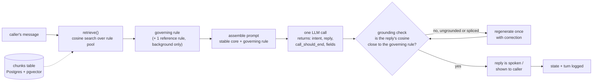
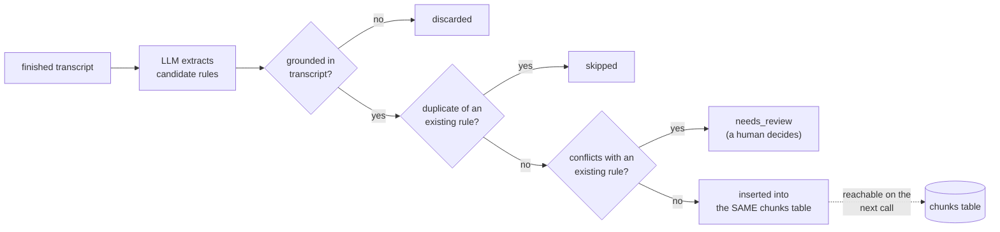

# SACE — how it works, in one picture

One flat pool of rules in Postgres replaces one giant system prompt. Every turn,
retrieval picks the **one rule** that governs this reply, sends only that to the
model, and checks the reply actually came from it.

## Live call



**Why this matters:** the model never sees the whole rulebook — just the one rule
that applies right now. Add rule #100 and every other turn's cost stays the same.

## After the call ends (separate, offline)



**Why this matters:** nothing the agent "learns" is applied silently — it either
passes all three checks or lands in a review queue for a person to look at.

## The two pieces together

```
                 live call path                 offline learning path
                 (every turn)                   (once, after call ends)
┌─────────────────────────────┐        ┌───────────────────────────────┐
│ caller → retrieve → LLM →    │        │ transcript → extract →        │
│ grounding check → reply      │        │ 3 gates → insert or review    │
└──────────────┬───────────────┘        └───────────────┬───────────────┘
               │  reads from                              │ writes to
               ▼                                          ▼
                     ┌───────────────────────┐
                     │   chunks (the pool)   │
                     │  seed rules + learned │
                     └───────────────────────┘
```

## Key numbers

| | |
|---|---|
| Rules in the pool | 33 seed (19 general + 14 intent-routed) + N learned |
| Monolith baseline | 5,782 tokens, sent every turn |
| Retrieved-pool cost | 965–1,296 tokens/turn (78–83% smaller) |
| Grounding floor | cosine ≥ 0.45 against the governing rule |
| Regeneration budget | 1 retry, with an explicit correction |

Full detail (every function, every table column, every edge case) is in
[ARCHITECTURE.md](ARCHITECTURE.md). This page is the one-screen version.
