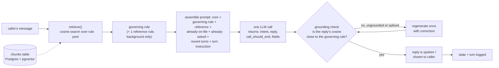
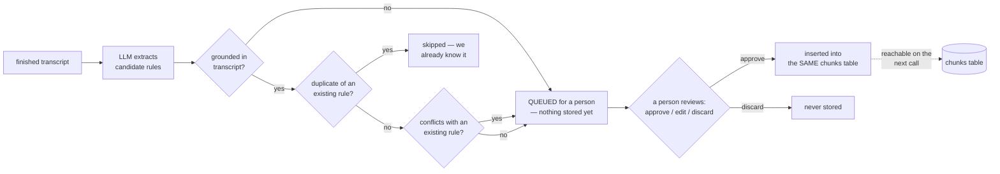
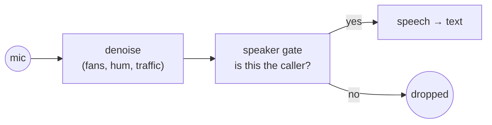
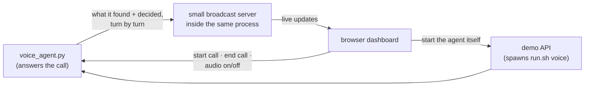
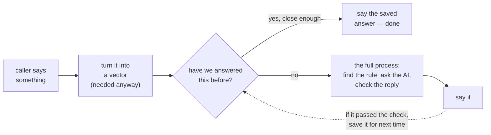

# SACE — how it works, in one picture

One flat pool of rules in Postgres replaces one giant system prompt. Every turn,
retrieval picks the **one rule** that governs this reply, sends only that to the
model, and checks the reply actually came from it.

Two things now sit on top of this loop, both covered below: real calls come in
through **`voice_agent.py`**, a voice agent talking over the phone-call-like
LiveKit connection (not the chat demo) — and a **live dashboard** lets someone
watch, turn by turn, what memory found and whether the reply stuck to it, while
a call is actually happening.

## Live call



**Why this matters:** the model never sees the whole rulebook — just the one rule
that applies right now. Add rule #100 and every other turn's cost stays the same.

## After the call ends (separate, offline)



**Why this matters:** the agent cannot change its own behaviour. Everything it
proposes waits for a person, who can approve it, rewrite it first, or throw it
away. The automatic checks only decide what's worth a person's attention — they
don't decide what goes into memory.

## Hearing only the caller

Before a word reaches the "listen" step, two filters run on the microphone:



They are separate because they do different jobs, and conflating them hides
the important one: **a denoiser cannot reject a person** — another human voice
is speech, which is exactly what it is built to preserve. Only the speaker gate
rejects other people, and it does that by being shown the caller's voice once
in advance (`scripts/enroll_voice.py`) and comparing every utterance against it.

With no enrolment the gate is simply off and everything is transcribed, so the
feature is opt-in. Both layers can be toggled from the dashboard mid-call.

## Watching and driving a live call

`voice_agent.py` is the agent that actually answers calls. While it's running,
a small server inside it broadcasts what it's doing to a browser dashboard —
so a person can watch, live, which piece of memory got picked for each turn
and whether the reply stuck to it.

The dashboard can also **start** a call, end one, and switch the audio filters.
What it cannot do is influence what gets said: it starts and stops
conversations, it does not take part in them.



Starting the agent goes through the API rather than the dashboard's own
connection, and it has to: that connection is opened *by* the agent, so it does
not exist while the agent is down — which is exactly when "start it" is needed.

Every card the dashboard shows is something the agent had already worked out
for itself — memory search result, prompt size, whether the reply passed the
grounding check, what the after-call learning step decided. Nothing on the
dashboard side decides what to say; it narrates what already happened.

## The two pieces together

```
                 live call path                 offline learning path
                 (every turn)                   (once, after call ends)
┌─────────────────────────────┐        ┌───────────────────────────────┐
│ caller → retrieve → LLM →    │        │ transcript → extract →        │
│ grounding check → reply      │        │ 3 gates → insert or review    │
└──────────────┬───────────────┘        └───────────────┬───────────────┘
               │  reads from                              │ writes to
               ▼                                          ▼
                     ┌───────────────────────┐
                     │   chunks (the pool)   │
                     │  seed rules + learned │
                     └───────────────────────┘
```

## Skipping the work when we already know the answer

Some things get asked over and over — "is this recorded?", "do I have a
copay?". Doing the whole process again each time is wasted effort, because we
already worked out the right answer and already checked it was right.

So once a reply has passed the grounding check, we save the pair: what the
caller asked → what we correctly answered. If a later caller asks close enough
to the same thing, we just say the saved answer. **About 250ms instead of about
1900ms.**



**Why a 'no' costs almost nothing:** the vector in step 2 is something the
normal process already builds on every turn — so checking the saved answers
reuses it instead of redoing it. A miss is one extra quick database lookup,
smaller than the normal variation between turns. If we had built the vector
just for the cache, every miss would have wasted real time.

**What never gets the shortcut**, no matter how often it's said: do-not-call
requests, abusive callers, medical emergencies, anything that ends the call,
the first thing said on a call, and any reply that mentioned something specific
to that caller. Those always go through the full process, every time.

## Key numbers

| | |
|---|---|
| Rules in the pool | 39 seed (21 general + 18 intent-routed) + N learned (grows over time — check `phase1_stats.py` for the current count) |
| Monolith baseline | 5,782 tokens, sent every turn |
| Retrieved-pool cost | roughly 1,000–1,350 tokens/turn (about 77–82% smaller) |
| Grounding floor | cosine ≥ 0.45 against the governing rule |
| Duplicate-rule bar | cosine > 0.72, compared only against rules in the same section |
| Regeneration budget | 1 retry, with an explicit correction |
| Reused-answer bar | cosine ≥ 0.68 (measured: same question 0.76–0.88, different question 0.12–0.54) |
| Reused answer, cost | ~250ms vs ~1900ms for the full process (87% less) |
| Reused-answer dedup bar | cosine ≥ 0.93 — higher than the serve bar on purpose, so the table can hold two phrasings of one question |
| Speaker-gate bar | cosine ≥ 0.45 (measured: same speaker 0.89, different speakers 0.24–0.25) |
| Audio filtering, cost | ~39ms per utterance (~0.3% of a 7–14s turn) |

Full detail (every function, every table column, every edge case) is in
[ARCHITECTURE.md](ARCHITECTURE.md). This page is the one-screen version.
