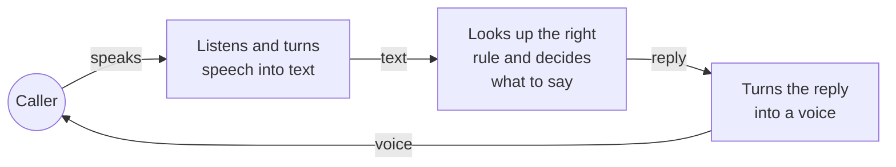
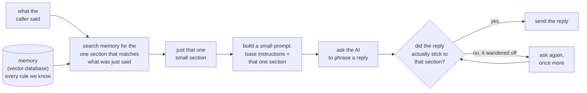
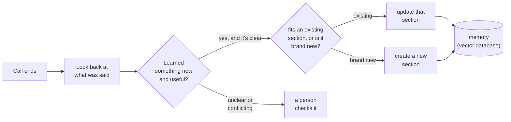

# How a call works

That's the whole loop, repeated every time the caller says something.

- **Listens and turns speech into text** — this is Deepgram.
- **Looks up the right rule and decides what to say** — this is our own
  idea (SACE). Explained in detail below.
- **Turns the reply into a voice** — this is Deepgram again, reading the
  reply out loud.

## The core idea: a memory instead of one giant prompt

The usual way to build one of these agents is to write ONE huge prompt
that tries to cover every situation up front, and send that whole thing to
the AI on every single turn — whether or not most of it is even relevant
to what the caller just said. That gets slow, expensive, and hard to
maintain as more situations get added.

Instead, we keep everything in a **memory** — really just a database that
stores each rule along with a short note on when it applies. This is what
a **vector database** is: a database you can search by *meaning*, not
just exact words. On every turn, we search that memory for the one small
section that's actually relevant to what the caller just said, and only
attach *that* section to the prompt. The prompt sent to the AI is small
and different every time, built fresh from whatever just happened — that's
what "dynamic prompting" means here: the prompt isn't fixed, it's
assembled per turn out of memory.

Why this matters:

- **The prompt stays small no matter how much the agent knows.** Whether
  memory holds 30 sections or 3,000, each turn only ever pulls in the one
  that's relevant — the prompt doesn't grow with everything we've ever
  taught it.
- **The AI only ever sees that one section**, not all of memory — so it
  can't blend two situations together or get confused between them.
- **We double-check the reply actually used that section** before it's
  sent out. If the AI drifts and says something that section didn't ask
  for, we catch it and ask again — this is what keeps the agent from
  going off-script.

## After the call: memory updates itself

Once the call ends, we look back at the whole conversation to see if
anything happened that memory doesn't already cover. If we find something
new and it's clearly true and doesn't contradict what's already stored, it
gets written into memory — either added into an existing section (if it's
about something we already know) or saved as a brand-new section (if it's
a genuinely new situation). If it's unclear or conflicts with something,
it's set aside for a person to check — nothing new gets added silently.

This is the loop that makes the agent better over time without anyone
manually rewriting the prompt: live calls only ever *read* from memory, and
only this after-the-call step ever *writes* to it — so a call never gets
confused by something learned from itself, mid-conversation.

## Note on the earlier Twilio-style diagram

The version with Twilio and a separate "Mvue server" describes a different
setup than what we're running. Today calls come in through **LiveKit**
(not Twilio), and the "server" in the middle is our own rule-lookup system
(SACE) talking to a database, not a separate Mvue server. We don't yet have
a real phone number wired in — calls connect the same way a video-call app
connects, not by dialing a number.
