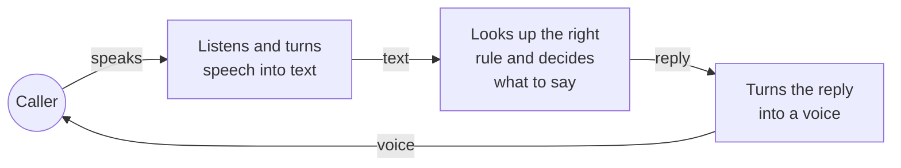
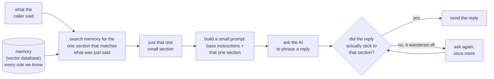
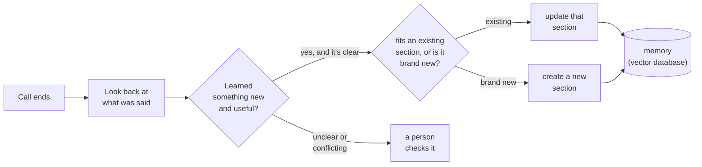
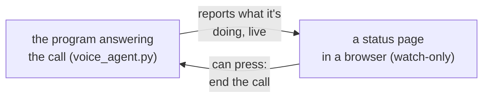

# How a call works

That's the whole loop, repeated every time the caller says something.

- **Listens and turns speech into text** — this is Deepgram.
- **Looks up the right rule and decides what to say** — this is our own
  idea (SACE). Explained in detail below.
- **Turns the reply into a voice** — this is Deepgram again, reading the
  reply out loud.

## The core idea: a memory instead of one giant prompt

The usual way to build one of these agents is to write ONE huge prompt
that tries to cover every situation up front, and send that whole thing to
the AI on every single turn — whether or not most of it is even relevant
to what the caller just said. That gets slow, expensive, and hard to
maintain as more situations get added.

Instead, we keep everything in a **memory** — really just a database that
stores each rule along with a short note on when it applies. This is what
a **vector database** is: a database you can search by *meaning*, not
just exact words. On every turn, we search that memory for the one small
section that's actually relevant to what the caller just said, and only
attach *that* section to the prompt. The prompt sent to the AI is small
and different every time, built fresh from whatever just happened — that's
what "dynamic prompting" means here: the prompt isn't fixed, it's
assembled per turn out of memory.

**What actually goes into that "small prompt"** — it's not just the one
section, it's a short stack of pieces, each with one job:

1. **Base instructions** — who Maya is, the goal of the call, tone, safety
   rules. Always the same, every turn.
2. **The one section retrieval found** — the only thing allowed to decide
   what Maya says next.
3. **Background (optional)** — a second, related section, shown only for
   context — never allowed to supply an actual line.
4. **Already on file** — anything the caller has already told Maya this
   call (a name, a county, a yes/no answer), so she never re-asks for it or
   makes up a different answer.
5. **Already asked** — questions already put to the caller, so the same
   question doesn't come back worded differently.
6. **The last few lines of the conversation** — just for context on who
   said what, not something Maya is allowed to pull a reply from.
7. **The instruction for this turn** — the exact shape of the answer
   Maya has to produce (a short reply, plus a few labels for what kind of
   moment this was).

All seven get joined into one prompt and sent fresh, every turn — nothing
is remembered "in the AI's head" between turns, it's rebuilt from scratch
each time out of whatever's true right now. On the live dashboard, each
turn's card has a "full prompt sent to the model this turn" section you can
open to see exactly this, word for word, for that turn.

Why this matters:

- **The prompt stays small no matter how much the agent knows.** Whether
  memory holds 30 sections or 3,000, each turn only ever pulls in the one
  that's relevant — the prompt doesn't grow with everything we've ever
  taught it.
- **The AI only ever sees that one section**, not all of memory — so it
  can't blend two situations together or get confused between them.
- **We double-check the reply actually used that section** before it's
  sent out. If the AI drifts and says something that section didn't ask
  for, we catch it and ask again — this is what keeps the agent from
  going off-script.

## After the call: memory updates itself

Once the call ends, we look back at the whole conversation to see if
anything happened that memory doesn't already cover. If we find something
new and it's clearly true and doesn't contradict what's already stored, it
gets written into memory — either added into an existing section (if it's
about something we already know) or saved as a brand-new section (if it's
a genuinely new situation). If it's unclear or conflicts with something,
it's set aside for a person to check — nothing new gets added silently.

This is the loop that makes the agent better over time without anyone
manually rewriting the prompt: live calls only ever *read* from memory, and
only this after-the-call step ever *writes* to it — so a call never gets
confused by something learned from itself, mid-conversation.

**For example:** if a caller says they still have their Medi-Cal benefits, the
agent doesn't just say "great, bye" — it now follows up with a short, natural
sub-conversation: it asks which county administers their coverage, then offers
to text them a renewal reminder for next year, then closes with a line that
matches whatever they said. That's three small memory sections chained
together (each one small enough to stay on-topic), instead of one giant
"if they still have coverage" block trying to cover every branch at once. The
same pattern is how newer situations — a caller asking about a copay, wanting
to book an appointment, asking how to renew, or asking for a supervisor — got
added: each is its own small, findable memory section rather than a patch
bolted onto an existing one.

## Watching a call happen

Calls are answered by a program called `voice_agent.py`. While a call is in
progress, that program can also feed a live status page in a browser — this
is separate from the phone call itself, and only useful if someone wants to
watch what's going on. It's watch-only for the most part: it shows, turn by
turn, what memory was searched, which section got picked and why, how small
the prompt actually was, and whether the reply that came back stuck to that
section — plus, once the call ends, what (if anything) the agent decided to
remember from it. The one thing that page can do besides watch is offer a
button to end the call early.

Nothing about how the call is handled changes because the page exists — it's
just a window onto decisions the agent was already making and already saving
to the database. If the page isn't open, the call runs exactly the same way.

## Note on the earlier Twilio-style diagram

The version with Twilio and a separate "Mvue server" describes a different
setup than what we're running. Today calls come in through **LiveKit**
(not Twilio), and the "server" in the middle is our own rule-lookup system
(SACE) talking to a database, not a separate Mvue server. We don't yet have
a real phone number wired in — calls connect the same way a video-call app
connects, not by dialing a number.
